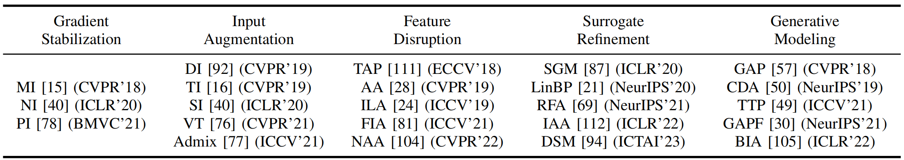
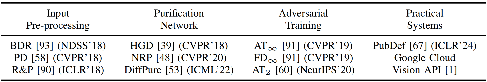
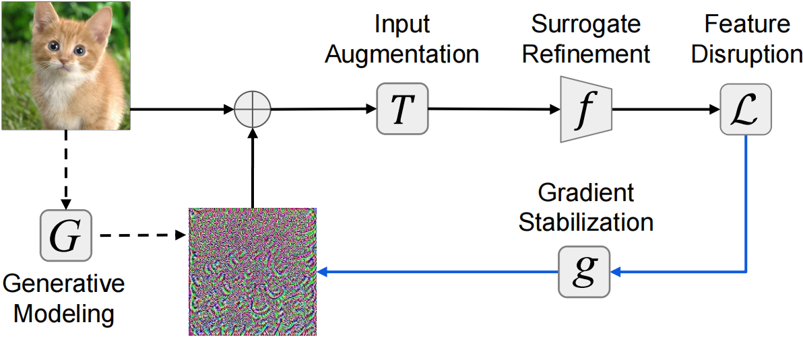

# Revisiting Transferable Adversarial Images

[Revisiting Transferable Adversarial Images: Systemization, Evaluation, and New Insights](https://arxiv.org/abs/2310.11850). Zhengyu Zhao*, Hanwei Zhang*, Renjue Li*, Ronan Sicre, Laurent Amsaleg, Michael Backes, Qi Li, Qian Wang, Chao Shen.

**We identify** two main problems in common evaluation practices: 
 (1) for attack transferability, lack of systematic, one-to-one attack comparisons and fair hyperparameter settings;
 (2) for attack stealthiness, simply no evaluations. 

**We address** these problems by
 (1) introducing a complete attack categorization and conducting systematic and fair intra-category analyses on transferability;
 (2) considering diverse imperceptibility metrics and finer-grained stealthiness characteristics from the perspective of attack traceback. 

**We draw** new insights, e.g.,
 (1) under a fair attack hyperparameter setting, one early attack method, DI, actually outperforms all the follow-up methods;
 (2) popular diffusion-based defenses give a false sense of security since it is indeed largely bypassed by (black-box) transferable attacks;
 (3) even when all attacks are bounded by the same Lp norm, they lead to dramatically different stealthiness performance, which negatively correlates with their transferability performance. 

**We provide** the first large-scale evaluation of transferable adversarial examples on ImageNet, involving 23 representative attacks against 9 representative defenses. 

**We reveal** that existing problematic evaluations have indeed caused misleading conclusions and missing points, and as a result, hindered the assessment of the actual progress in this field.

## Evaluated Attacks and Defenses 

## Attack Categorization (Welcome more papers!)

### Gradient Stabilization Attacks [[Code for 3 representative attacks]](https://github.com/ZhengyuZhao/TransferAttackEval/tree/main/attacks/gradient_stabilization_attacks.py)
+ [Boosting Adversarial Attacks with Momentum (CVPR 2018)](https://arxiv.org/abs/1710.06081)
+ [Nesterov Accelerated Gradient and Scale Invariance for Adversarial Attacks (ICLR 2020)](https://arxiv.org/abs/1908.06281)
+ [Boosting Adversarial Transferability through Enhanced Momentum (BMVC 2021)](https://arxiv.org/abs/2103.10609)
+ [Improving Adversarial Transferability with Spatial Momentum (arXiv 2022)](https://arxiv.org/abs/2203.13479)
+ [Making Adversarial Examples More Transferable and Indistinguishable (AAAI2022)](https://ojs.aaai.org/index.php/AAAI/article/view/20279)
+ [Boosting Adversarial Transferability by Achieving Flat Local Maxima (NeurIPS 2023)](https://arxiv.org/pdf/2306.05225)
+ [Transferable Adversarial Attack for Both Vision Transformers and Convolutional Networks via Momentum Integrated Gradients (ICCV 2023)](https://openaccess.thecvf.com/content/ICCV2023/papers/Ma_Transferable_Adversarial_Attack_for_Both_Vision_Transformers_and_Convolutional_Networks_ICCV_2023_paper.pdf)
+ [Boosting Adversarial Transferability via Gradient Relevance Attack (ICCV 2023)](https://openaccess.thecvf.com/content/ICCV2023/papers/Zhu_Boosting_Adversarial_Transferability_via_Gradient_Relevance_Attack_ICCV_2023_paper.pdf)

### Input Augmentation Attacks [[Code for 5 representative attacks]](https://github.com/ZhengyuZhao/TransferAttackEval/tree/main/attacks/input_augmentation_attacks.py)
+ [Improving Transferability of Adversarial Examples with Input Diversity (CVPR 2019)](https://arxiv.org/abs/1803.06978)
+ [Evading Defenses to Transferable Adversarial Examples by Translation-Invariant Attacks (CVPR 2019)](https://arxiv.org/abs/1904.02884)
+ [Nesterov Accelerated Gradient and Scale Invariance for Adversarial Attacks (ICLR 2020)](https://arxiv.org/abs/1908.06281)
+ [Patch-wise Attack for Fooling Deep Neural Network (ECCV 2020)](https://arxiv.org/abs/2007.06765)
+ [Improving the Transferability of Adversarial Examples with Resized-Diverse-Inputs, Diversity-Ensemble and Region Fitting (ECCV 2020)](https://arxiv.org/abs/2112.06011)
+ [Regional Homogeneity: Towards Learning Transferable Universal Adversarial Perturbations Against Defenses (ECCV 2020)](https://arxiv.org/abs/1904.00979)
+ [Enhancing the Transferability of Adversarial Attacks through Variance Tuning (CVPR 2021)](https://arxiv.org/abs/2103.15571)
+ [Admix: Enhancing the Transferability of Adversarial Attacks (ICCV 2021)](https://arxiv.org/abs/2102.00436)
+ [Improving the Transferability of Targeted Adversarial Examples through Object-Based Diverse Input (CVPR 2022)](https://arxiv.org/abs/2203.09123)
+ [Frequency Domain Model Augmentation for Adversarial Attack (ECCV 2022)](https://arxiv.org/abs/2207.05382)
+ [Adaptive Image Transformations for Transfer-based Adversarial Attack (ECCV 2022)](https://arxiv.org/abs/2111.13844)
+ [Boosting the Transferability of Adversarial Attacks with Reverse Adversarial Perturbation (NeurIPS 2022)](https://arxiv.org/abs/2210.05968)
+ [Enhancing the Self-Universality for Transferable Targeted Attacks (CVPR 2023)](https://arxiv.org/abs/2209.03716)
+ [Improving the Transferability of Adversarial Samples by Path-Augmented Method (CVPR 2023)](https://arxiv.org/abs/2303.15735)
+ [The Ultimate Combo: Boosting Adversarial Example Transferability by Composing Data Augmentations (arXiv 2023)](https://arxiv.org/abs/2312.11309)
+ [Structure Invariant Transformation for better Adversarial Transferability (ICCV 2023)](https://arxiv.org/pdf/2309.14700)
+ [Boosting Adversarial Transferability across Model Genus by Deformation-Constrained Warping (AAAI 2024)](https://arxiv.org/abs/2402.03951)
+ [Boosting Adversarial Transferability by Block Shuffle and Rotation (CVPR 2024)](https://arxiv.org/pdf/2308.10299)
+ [Learning to Transform Dynamically for Better Adversarial Transferability (CVPR 2024)](https://arxiv.org/abs/2405.14077)
+ [Boosting the Transferability of Adversarial Examples via Local Mixup and Adaptive Step Size (arXiv 2024)](https://arxiv.org/abs/2401.13205)
+ [Typography Leads Semantic Diversifying: Amplifying Adversarial Transferability across Multimodal Large Language Models (arXiv 2024)](https://arxiv.org/abs/2405.20090)
+ [Strong Transferable Adversarial Attacks via Ensembled Asymptotically Normal Distribution Learning (CVPR 2024)](https://openaccess.thecvf.com/content/CVPR2024/html/Fang_Strong_Transferable_Adversarial_Attacks_via_Ensembled_Asymptotically_Normal_Distribution_Learning_CVPR_2024_paper.html)
+ [Learning to Transform Dynamically for Better Adversarial Transferability (CVPR2024)](https://arxiv.org/pdf/2405.14077v1)

### Feature Disruption Attacks [[Code for 5 representative attacks]](https://github.com/ZhengyuZhao/TransferAttackEval/tree/main/attacks/feature_disruption_attacks.py)
+ [Transferable Adversarial Perturbations (ECCV 2018)](https://openaccess.thecvf.com/content_ECCV_2018/html/Bruce_Hou_Transferable_Adversarial_Perturbations_ECCV_2018_paper.html)
+ [Task-generalizable Adversarial Attack based on Perceptual Metric (arXiv 2018)](https://arxiv.org/abs/1811.09020)
+ [Feature Space Perturbations Yield More Transferable Adversarial Examples (CVPR 2019)](https://openaccess.thecvf.com/content_CVPR_2019/html/Inkawhich_Feature_Space_Perturbations_Yield_More_Transferable_Adversarial_Examples_CVPR_2019_paper.html)
+ [FDA: Feature Disruptive Attack (ICCV 2019)](https://arxiv.org/abs/1909.04385)
+ [Enhancing Adversarial Example Transferability with an Intermediate Level Attack (ICCV 2019)](https://arxiv.org/abs/1907.10823)
+ [Transferable Perturbations of Deep Feature Distributions (ICLR 2020)](https://arxiv.org/abs/2004.12519)
+ [Boosting the Transferability of Adversarial Samples via Attention (CVPR 2020)](https://openaccess.thecvf.com/content_CVPR_2020/html/Wu_Boosting_the_Transferability_of_Adversarial_Samples_via_Attention_CVPR_2020_paper.html)
+ [Towards Transferable Targeted Attack (CVPR 2020)](https://openaccess.thecvf.com/content_CVPR_2020/html/Li_Towards_Transferable_Targeted_Attack_CVPR_2020_paper.html)
+ [Yet Another Intermediate-Level Attack (ECCV 2020)](https://arxiv.org/abs/2008.08847)
+ [Perturbing Across the Feature Hierarchy to Improve Standard and Strict Blackbox Attack Transferability (NeurIPS 2020)](https://proceedings.neurips.cc/paper/2020/hash/eefc7bfe8fd6e2c8c01aa6ca7b1aab1a-Abstract.html)
+ [Feature Importance-aware Transferable Adversarial Attacks (ICCV 2021)](https://arxiv.org/abs/2107.14185)
+ [Improving Adversarial Transferability via Neuron Attribution-Based Attacks (CVPR 2022)](https://arxiv.org/abs/2204.00008)
+ [An Intermediate-level Attack Framework on The Basis of Linear Regression (TPAMI 2022)](https://arxiv.org/abs/2203.10723)
+ [Introducing Competition to Boost the Transferability of Targeted Adversarial Examples through Clean Feature Mixup (CVPR 2023)](https://arxiv.org/abs/2305.14846)
+ [Diversifying the High-level Features for better Adversarial Transferability (BMVC 2023)](https://arxiv.org/abs/2304.10136)
+ [Improving Adversarial Transferability via Intermediate-level Perturbation Decay (NeurIPS 2023)](https://arxiv.org/abs/2304.13410v3)
+ [Boosting Adversarial Transferability via Fusing Logits of Top-1 Decomposed Feature (arXiv 2023)](https://arxiv.org/abs/2305.01361)

### Surrogate Refinement Attacks [[Code for 5 representative attacks]](https://github.com/ZhengyuZhao/TransferAttackEval/tree/main/attacks/surrogate_refinement_attacks.py)
+ [Learning Transferable Adversarial Examples via Ghost Networks (AAAI 2020)](https://arxiv.org/abs/1812.03413)
+ [Skip Connections Matter: On the Transferability of Adversarial Examples Generated with ResNets (ICLR 2020)](https://arxiv.org/abs/2002.05990)
+ [Backpropagating Linearly Improves Transferability of Adversarial Examples (NeurIPS 2020)](https://arxiv.org/abs/2012.03528)
+ [Backpropagating Smoothly Improves Transferability of Adversarial Examples (CVPRw 2021)](https://aisecure-workshop.github.io/amlcvpr2021/cr/31.pdf)
+ [A Little Robustness Goes a Long Way: Leveraging Robust Features for Targeted Transfer Attacks (NeurIPS 2021)](https://arxiv.org/abs/2106.02105)
+ [Early Stop and Adversarial Training Yield Better Surrogate Model: Very Non-Robust Features Harm Adversarial Transferability (OpenReview 2021)](https://openreview.net/forum?id=ECC7T-torK)
+ [Stochastic Variance Reduced Ensemble Adversarial Attack for Boosting the Adversarial Transferability (CVPR 2022)](https://openaccess.thecvf.com/content/CVPR2022/html/Xiong_Stochastic_Variance_Reduced_Ensemble_Adversarial_Attack_for_Boosting_the_Adversarial_CVPR_2022_paper.html)
+ [Training Meta-Surrogate Model for Transferable Adversarial Attack (arXiv 2021)](https://arxiv.org/abs/2109.01983)
+ [On Improving Adversarial Transferability of Vision Transformers (ICLR2022)](https://arxiv.org/abs/2106.04169)
+ [Rethinking Adversarial Transferability from a Data Distribution Perspective (ICLR 2022)](https://openreview.net/forum?id=gVRhIEajG1k)
+ [Boosting the Adversarial Transferability of Surrogate Model with Dark Knowledge (arXiv 2022)](https://arxiv.org/abs/2206.08316)
+ [Towards Transferable Adversarial Attacks on Vision Transformers (AAAI 2022)](https://arxiv.org/abs/2109.04176)
+ [Transferable Adversarial Attacks on Vision Transformers with Token Gradient Regularization (CVPR 2023)](https://arxiv.org/abs/2303.15754)
+ [Minimizing Maximum Model Discrepancy for Transferable Black-box Targeted Attacks (CVPR 2023)](https://arxiv.org/abs/2212.09035)
+ [Towards Transferable Targeted Adversarial Examples (CVPR 2023)](https://openaccess.thecvf.com/content/CVPR2023/papers/Wang_Towards_Transferable_Targeted_Adversarial_Examples_CVPR_2023_paper.pdf)
+ [StyLess: Boosting the Transferability of Adversarial Examples (CVPR 2023)](https://arxiv.org/abs/2304.11579)
+ [How to choose your best allies for a transferable attack? (ICCV 2023)](https://arxiv.org/abs/2304.02312)
+ [An Adaptive Model Ensemble Adversarial Attack for Boosting Adversarial Transferability (ICCV 2023)](https://arxiv.org/abs/2308.02897)
+ [Backpropagation Path Search On Adversarial Transferability (ICCV 2023)](https://arxiv.org/abs/2308.07625)
+ [Going Further: Flatness at the Rescue of Early Stopping for Adversarial Example Transferability (arXiv 2023)](https://arxiv.org/abs/2304.02688)
+ [Making Substitute Models More Bayesian Can Enhance Transferability of Adversarial Examples (ICLR 2023)](https://openreview.net/pdf?id=bjPPypbLre)
+ [Blurred-Dilated Method for Adversarial Attacks (NeurIPS 2023)](https://papers.nips.cc/paper_files/paper/2023/hash/b6fa3ed9624c184bd73e435123bd576a-Abstract-Conference.html)
+ [Rethinking the Backward Propagation for Adversarial Transferability (NeurIPS 2023)](https://arxiv.org/abs/2306.12685)
+ [Rethinking Model Ensemble in Transfer-based Adversarial Attacks (ICLR 2024)](https://arxiv.org/abs/2303.09105)
+ [Why Does Little Robustness Help? Understanding and Improving Adversarial Transferability from Surrogate Training (S&P 2024)](https://arxiv.org/abs/2307.07873v4)
+ [Enhance Stealthiness and Transferability of Adversarial Attacks with Class Activation Mapping Ensemble Attack (NDSS 2024)](https://www.ndss-symposium.org/ndss-paper/enhance-stealthiness-and-transferability-of-adversarial-attacks-with-class-activation-mapping-ensemble-attack/)
+ [Improving Transferable Targeted Adversarial Attacks with Model Self-Enhancement (CVPR 2024)](https://openaccess.thecvf.com/content/CVPR2024/html/Wu_Improving_Transferable_Targeted_Adversarial_Attacks_with_Model_Self-Enhancement_CVPR_2024_paper.html)
+ [AGS: Affordable and Generalizable Substitute Training for Transferable Adversarial Attack (AAAI 2024)](https://ojs.aaai.org/index.php/AAAI/article/view/28365)
+ [Ensemble Diversity Facilitates Adversarial Transferability (CVPR 2024)](https://openaccess.thecvf.com/content/CVPR2024/html/Tang_Ensemble_Diversity_Facilitates_Adversarial_Transferability_CVPR_2024_paper.html)

### Generative Modeling Attacks
+ [Generative Adversarial Perturbations (CVPR 2018)](https://arxiv.org/abs/1712.02328)
+ [Cross-Domain Transferability of Adversarial Perturbations (NeurIPS 2019)](https://arxiv.org/abs/1905.11736)
+ [On Generating Transferable Targeted Perturbations (ICCV 2021)](https://arxiv.org/abs/2103.14641)
+ [Learning Transferable Adversarial Perturbations (NeurIPS 2021)](https://proceedings.neurips.cc/paper/2021/hash/7486cef2522ee03547cfb970a404a874-Abstract.html)
+ [Beyond ImageNet Attack: Towards Crafting Adversarial Examples for Black-box Domains (ICLR 2022)](https://arxiv.org/abs/2201.11528)
+ [Boosting Transferability of Targeted Adversarial Examples via Hierarchical Generative Networks (ECCV 2022)](https://arxiv.org/abs/2107.01809)
+ [Dynamic Generative Targeted Attacks With Pattern Injection (CVPR 2023)](https://openaccess.thecvf.com/content/CVPR2023/html/Feng_Dynamic_Generative_Targeted_Attacks_With_Pattern_Injection_CVPR_2023_paper.html)
+ [Towards Transferable Targeted Adversarial Examples (CVPR 2023)](https://openaccess.thecvf.com/content/CVPR2023/html/Wang_Towards_Transferable_Targeted_Adversarial_Examples_CVPR_2023_paper.html)
+ [Perturbation Towards Easy Samples Improves Targeted Adversarial Transferability (NeurIPS 2023)](https://arxiv.org/abs/2406.05535)

## Surveys/Evaluations/Explanations
+ [Delving into Transferable Adversarial Examples and Black-box Attacks (ICLR 2017)](https://arxiv.org/abs/1611.02770)
+ [The Space of Transferable Adversarial Examples (arXiv 2017)](https://arxiv.org/abs/1704.03453)
+ [Why Do Adversarial Attacks Transfer? Explaining Transferability of Evasion and Poisoning Attacks (USENIX Security 2019)](https://arxiv.org/abs/1809.02861)
+ [Selection of Source Images Heavily Influences the Effectiveness of Adversarial Attacks (BMVC 2021)](https://arxiv.org/abs/2106.07141)
+ [On Success and Simplicity: A Second Look at Transferable Targeted Attacks (NeurIPS 2021)](https://arxiv.org/abs/2012.11207)
+ [Evaluating Adversarial Attacks on ImageNet: A Reality Check on Misclassification Classes (NeurIPSw 2021)](https://arxiv.org/abs/2111.11056)
+ [A Unified Approach to Interpreting and Boosting Adversarial Transferability (ICLR 2021)](https://arxiv.org/abs/2010.04055)
+ [Transfer Attacks Revisited: A Large-Scale Empirical Study in Real Computer Vision Settings (IEEE S&P 2022)](https://arxiv.org/abs/2204.04063)
+ [Towards Evaluating Transfer-based Attacks Systematically, Practically, and Fairly (NeurIPS 2023)](https://arxiv.org/abs/2311.01323)
+ [Beyond Boundaries: A Comprehensive Survey of Transferable Attacks on AI Systems (arXiv 2023)](https://arxiv.org/abs/2311.11796)
+ [A Survey on Transferability of Adversarial Examples across Deep Neural Networks (arXiv 2023)](https://arxiv.org/abs/2310.17626)
+ [Bag of Tricks to Boost Adversarial Transferability (arXiv 2024)](https://arxiv.org/abs/2401.08734)
